# OpenCode Agentic Framework

[](https://github.com/rafaelbm/dotfiles-opencode)
[](https://opensource.org/licenses/MIT)
[](https://github.com/rafaelbm/dotfiles-opencode)

> **AI-powered multi-agent development workflow for consistent, high-quality software engineering.**

A comprehensive configuration framework that orchestrates specialized AI agents to plan, build, test, debug, and review code with architectural rigor and engineering best practices.

---

## Table of Contents

- [Agentic Workflow](#agentic-workflow)
- [Architecture Overview](#architecture-overview)
- [Agents](#agents)
  - [Primary Agents](#primary-agents)
  - [Subagents](#subagents)
- [Available Skills](#available-skills)
- [MCP Servers](#mcp-servers)
  - [Configured MCP Servers](#configured-mcp-servers)
- [Permission Model](#permission-model)
- [Workflow Example](#workflow-example)
- [Installation](#installation)
  - [Quick Start](#quick-start)
  - [CLI Setup (Interactive Installer)](#cli-setup-interactive-installer)
- [Advanced Usage](#advanced-usage)
- [Troubleshooting](#troubleshooting)
- [File Descriptions](#file-descriptions)

---

## Agentic Workflow

This OpenCode Agentic Framework implements a **plan-first, delegate-always** workflow that separates planning from execution to ensure safe, auditable, and high-quality software development.

### Workflow Flow



### Feedback Loops

The workflow includes intelligent feedback loops for quality assurance:

1. **Test Failure Loop**: If tests fail → `@debug` diagnoses → `@general` fixes → `@testing` validates
2. **Review Issues Loop**: If review finds Critical/Major issues → `@general` addresses → `@review` re-verifies
3. **Discovery Loop**: If facts are missing → `@explore` investigates → planning/execution resumes

### Agent Collaboration

Agents collaborate through a **delegation pattern** where primary agents (@plan, @build) orchestrate subagents (@explore, @general, @testing, @debug, @review). Each agent has a single responsibility and communicates through structured outputs.

---

## Architecture Overview

### Plan-First Pattern

The framework enforces a **plan-first** approach to software development:

1. **@plan** creates an execution plan based on requirements
2. **@build** executes the plan by delegating to specialized subagents
3. **Feedback loops** ensure quality at each stage
4. **Documentation** is maintained throughout the process

This pattern ensures that:
- Implementation decisions are made after understanding the codebase
- Changes are deliberate and reversible
- Quality gates (testing, review) are mandatory
- Knowledge is captured in documentation

### Agent Hierarchy

| Type | Agents | Responsibility |
|------|--------|----------------|
| **Primary** | @plan, @build | Orchestration and coordination |
| **Subagent** | @explore, @general, @testing, @debug, @review | Specialized execution |

### Agent Comparison

| Name | Mode | Model | Primary Purpose |
|------|------|-------|-----------------|
| @plan | Primary | Default | Creates implementation-ready execution plans |
| @build | Primary | Default | Orchestrates execution by delegating to subagents |
| @explore | Subagent | opencode-go/glm-5 | Read-only repository discovery and evidence gathering |
| @general | Subagent | opencode-go/glm-5 | Complex implementation, commands, file changes |
| @testing | Subagent | opencode-go/glm-5 | Test generation, execution, and analysis |
| @debug | Subagent | opencode-go/glm-5 | Failure diagnosis, error tracing, root cause analysis |
| @review | Subagent | opencode-go/glm-5 | Code review focused on SOLID, security, maintainability |

---

## Agents

### Primary Agents

#### @plan — Planning Agent

**Purpose**: Transforms ambiguous requests into concrete, executable sequences of steps for the execution agent.

**When to use**: At the start of any non-trivial task when you need a structured plan before implementation.

**Model**: Default

**Key Capabilities**:
- Analyzes requirements and identifies necessary steps
- Delegates discovery to @explore for codebase facts
- Creates numbered, verb-first execution plans
- Ensures plans include review steps for implementations
- Cannot edit files or run commands directly

**Restrictions**: Read-only; all discovery delegated to @explore

---

#### @build — Build Agent

**Purpose**: Orchestrates repository inspection, implementation, debugging, and review by delegating to subagents.

**When to use**: For executing tasks, whether or not a prior plan exists.

**Model**: Default

**Key Capabilities**:
- Executes plans step-by-step through delegation
- Manages the complete development lifecycle
- Coordinates test generation and execution
- Handles debugging cycles when issues arise
- Enforces code review before completion
- Cannot edit files or run commands directly

**Execution Loop**:
1. Delegate implementation to @general
2. Delegate test generation to @testing
3. If tests fail, delegate diagnosis to @debug
4. Once debug identifies root cause, return to @general
5. Validate with @testing
6. Delegate code review to @review
7. Address any Critical/Major issues
8. Report final result

---

### Subagents

#### @explore — Discovery Agent

**Purpose**: Deep read-only repository discovery to resolve ambiguity and gather evidence.

**When to use**: When you need to understand existing code, find entry points, or gather facts before making changes.

**Model**: opencode-go/glm-5

**Key Capabilities**:
- Locates relevant files and directories
- Extracts exact snippets, paths, key symbols, configs
- Identifies sources of truth (types, runtime paths, configs)
- Cannot edit files or propose refactors
- Read-only git commands allowed (status, diff, log, show, grep)

**Restrictions**: 
- No file edits
- No bash commands (except git read-only)
- No web fetching
- No task delegation

**Output Format**:
- Conclusion (1–2 lines)
- Findings (bullets with file paths)
- Evidence (bullets with snippets and line references)
- Rationale (max 3 bullets)
- Next actions (max 5 bullets)

---

#### @general — General Agent

**Purpose**: Execution agent for complex or ambiguous tasks. Implements solutions and validates them.

**When to use**: For implementing changes, running commands, and performing validation.

**Model**: opencode-go/glm-5

**Key Capabilities**:
- Edits files and runs bash commands
- Implements solutions based on available facts
- Validates results using relevant checks
- Can request discovery passes when blocked
- Uses skills for specialized tasks

**Key Restrictions**:
- No git commit/push without human approval
- No destructive commands (rm -rf, sudo)
- No development server commands (blocked for security)
- Cannot delegate to other agents

**Available Skills**:
- @conventional-commit — Commit message formatting
- @adr — Architecture Decision Records
- @docs-structure — docs/ directory maintenance
- @frontend-design — UI component implementation
- @ux-patterns — Interactive components
- @accessibility — WCAG 2.1 AA compliance
- @ui-architecture — Component hierarchy design

**Output Format**:
- Approach (1–2 lines)
- Changes (bullets: file path + what changed)
- Commands run (exact commands + result)
- Rationale (max 5 bullets)
- Follow-ups (optional; max 3)

---

#### @testing — Testing Agent

**Purpose**: Generates, executes, and analyzes tests at all levels (unit, integration, E2E).

**When to use**: After implementation to validate changes, or when debugging to verify fixes.

**Model**: opencode-go/glm-5

**Key Capabilities**:
- Generates unit, integration, and E2E tests
- Executes test suites and reports results
- Analyzes coverage and identifies gaps
- Follows existing testing conventions
- Only modifies test files (not production code)

**Testing Levels**:
- **Unit**: Test behavior through public APIs, mock external dependencies
- **Integration**: Test module interactions with real implementations
- **E2E**: Test critical user flows with mocked APIs

**Available Skills**:
- @testing-patterns — Angular testing with Vitest and Playwright

**Key Restrictions**:
- Edits restricted to test files only
- No production code modifications
- Cannot skip test execution

---

#### @debug — Debugging Agent

**Purpose**: Diagnoses failures, traces errors to their root cause, and validates fixes.

**When to use**: When @general encounters failures it cannot resolve, or when tests fail after implementation.

**Model**: opencode-go/glm-5

**Key Capabilities**:
- Reproduces failures before diagnosing
- Traces errors from symptom to root cause
- Distinguishes failure site from root cause
- Validates that fixes resolve the problem
- Cannot implement fixes (only identifies them)

**Key Restrictions**:
- No file edits
- Cannot propose refactors unrelated to the failure
- Must have evidence before concluding

**Output Format**:
- Failure summary (1–2 lines)
- Root cause (precise location and explanation)
- Evidence (commands run and output)
- Proposed fix (description, not implementation)
- Validation commands

---

#### @review — Review Agent

**Purpose**: Read-only code review focused on architecture, SOLID principles, security, and maintainability.

**When to use**: Automatically invoked after every implementation by @general; can be invoked manually for any code review.

**Model**: opencode-go/glm-5

**Key Capabilities**:
- Analyzes code for correctness, security, SOLID principles
- Identifies DRY violations
- Assesses maintainability and architecture
- Cannot edit files or propose implementation steps
- Uses skills for specialized review criteria

**Review Criteria** (in priority order):
1. Correctness (logic errors, edge cases)
2. Security (input validation, sensitive data exposure)
3. SOLID principles (explicit violation naming)
4. DRY (duplication flagging)
5. Maintainability (naming, separation of concerns)
6. Architecture (boundary violations, dependencies)

**Available Skills**:
- @solid-review — SOLID and DRY violations
- @accessibility — WCAG 2.1 AA compliance review
- @ui-architecture — UI structure review
- @ux-patterns — Interactive behavior review

**Output Format**:
- Summary (1–2 lines)
- Issues (severity, file path, description)
- SOLID/DRY violations (principle name, location, explanation)
- Recommendations (max 5 bullets)

---

## Available Skills

Skills are specialized knowledge modules that agents invoke for specific tasks. Each skill is a directory containing `SKILL.md` with implementation guidelines.

### Frontend

| Skill | Description |
|-------|-------------|
| **frontend-design** | Create distinctive, production-grade frontend interfaces with high design quality. Commits to aesthetic direction before coding. |
| **ux-patterns** | Apply proven interaction patterns for forms, navigation, feedback, empty states, and loading. |
| **ui-architecture** | Structure UI into components, layouts, and state boundaries. Designs component hierarchy and decides where state lives. |
| **accessibility** | Apply WCAG 2.1 AA compliance and ARIA patterns to UI components. Ensures keyboard, screen reader, and contrast requirements. |

### Quality

| Skill | Description |
|-------|-------------|
| **solid-review** | Reference guide for identifying and correcting SOLID and DRY violations during code review or implementation. |
| **testing-patterns** | Testing conventions and patterns for Angular applications. Covers unit tests with Vitest, integration tests, and E2E tests with Playwright. |

### Documentation

| Skill | Description |
|-------|-------------|
| **adr** | Create and maintain Architecture Decision Records in `docs/adr/`. Documents significant architectural decisions with context, alternatives, and consequences. |
| **docs-structure** | Reference for maintaining the `docs/` directory: what goes where, when to create new files vs update existing ones. |
| **conventional-commit** | Create commits following the Conventional Commits specification with short, clear English messages. |

---

## MCP Servers

MCP (Model Context Protocol) servers extend agent capabilities by providing access to external tools and services. These servers are configured in `opencode.json` and managed automatically.

### What is MCP?

Model Context Protocol (MCP) is a standardized protocol that allows AI agents to interact with external tools, APIs, and services. MCP servers act as bridges between the agent and the external world.

### Configured MCP Servers

| Server | Purpose | Command |
|--------|---------|---------|
| **Playwright** | Browser automation for E2E testing | `npx @playwright/mcp@latest --browser chrome --viewport-size 1920x1080` |
| **Context7** | Library documentation search and code examples | `npx -y @upstash/context7-mcp` |
| **Shadcn** | UI component management and registry | `npx shadcn@latest mcp` |

### Playwright MCP

- Automates browser interactions for end-to-end testing
- Supports Chrome browser at 1920x1080 viewport
- Enables screenshot capture, element interaction, and navigation
- Integrates with @testing agent for E2E test execution

### Context7 MCP

- Resolves library names to Context7-compatible IDs
- Retrieves up-to-date documentation and code examples
- Supports major frameworks and libraries
- Used by agents to answer "how-to" questions about specific libraries

### Shadcn MCP

- Lists and searches UI components from registries
- Provides installation commands for components
- Views detailed component information and examples
- Integrates with frontend development workflows

---

## Permission Model

The framework implements a **least privilege** permission system where agents have only the permissions necessary for their role.

### Permission Categories

| Category | Description |
|----------|-------------|
| **read** | File reading permissions |
| **edit** | File modification permissions |
| **bash** | Command execution permissions |
| **browser** | Browser automation (via MCP) |
| **task** | Delegation to other agents |
| **webfetch** | Web resource fetching |

### Permission Matrix

| Agent | Read | Edit | Bash | Browser | Task | Webfetch |
|-------|:----:|:----:|:----:|:-------:|:----:|:--------:|
| **@plan** | ❌ | ❌ | ❌ | ❌ | ✅ (explore only) | ❌ |
| **@build** | ❌ | ❌ | ❌ | ❌ | ✅ (all subagents) | ❌ |
| **@explore** | ✅ | ❌ | ✅ (git only) | ❌ | ❌ | ❌ |
| **@general** | ✅ | ✅ | ✅ | ❌ | ❌ | ❌ |
| **@testing** | ✅ | ✅ (tests only) | ✅ (test commands) | ✅ | ❌ | ❌ |
| **@debug** | ✅ | ❌ | ✅ (test/lint) | ❌ | ❌ | ❌ |
| **@review** | ✅ | ❌ | ❌ | ❌ | ❌ | ❌ |

### Key Permission Principles

1. **Primary agents cannot use tools directly** — They only delegate to subagents
2. **Subagents have restricted scope** — Each subagent is specialized and limited
3. **Environment files are protected** — `.env` files cannot be read (except `.env.example`)
4. **Destructive commands blocked** — `rm -rf`, `sudo`, and similar commands are denied
5. **Development servers blocked** — Commands like `npm run dev` are denied for security
6. **Git operations require approval** — Most git commands require human confirmation

---

## Workflow Example

A complete 8-step example of the agentic workflow in action:

### 1. User Requests Feature

```
User: "Add user authentication to the application"
```

### 2. @plan Creates Plan

```
@plan receives the request and creates an execution plan:

1. Investigate existing auth infrastructure in the codebase
2. Design authentication flow (login, logout, token management)
3. Implement auth service with login/logout methods
4. Create login UI component with form validation
5. Add route guards for protected routes
6. Write unit tests for auth service
7. Write integration tests for auth flow
8. Write E2E tests for login journey
9. Perform code review
10. Update documentation
```

### 3. @explore Investigates

```
@build delegates to @explore:
"I will locate the project entrypoints and relevant configuration in the repository."

@explore returns:
- Framework: Angular with standalone components
- Existing auth: None
- HTTP client: Already configured
- Testing: Vitest + Playwright
- Routing: Angular Router with lazy loading
```

### 4. @build Delegates Implementation

```
@build delegates to @general:
"I will implement the authentication service with JWT token management."

@general:
- Creates auth.service.ts with login/logout methods
- Creates auth.guard.ts for route protection
- Creates login.component.ts with reactive forms
- Updates app.config.ts to provide auth services
```

### 5. @testing Validates

```
@build delegates to @testing:
"I will generate and execute tests for the authentication implementation."

@testing:
- Writes auth.service.spec.ts (unit tests)
- Writes auth flow integration tests
- Writes login E2E test with mocked API
- All tests pass ✅
```

### 6. @review Verifies

```
@build delegates to @review:
"I will review the authentication implementation for quality and security."

@review reports:
- Summary: Good implementation with proper separation of concerns
- Minor: Add input sanitization in login form
- No Critical or Major issues ✅
```

### 7. Final Result

```
@build reports to user:

✅ Authentication feature implemented successfully

**Changes:**
- src/app/core/services/auth.service.ts (new)
- src/app/core/guards/auth.guard.ts (new)
- src/app/features/auth/login.component.ts (new)
- src/app/app.config.ts (updated)

**Tests:**
- 12 unit tests (all passing)
- 3 integration tests (all passing)
- 2 E2E tests (all passing)

**Review:**
- No Critical or Major issues
- 1 Minor suggestion addressed

**Documentation:**
- ADR-0003: Authentication Architecture Decision Record created
```

### 8. (If Issues) Debug Cycle

If tests had failed:
```
@testing reports: "Login test fails with 401 error"

@build delegates to @debug:
"I will diagnose the authentication test failure."

@debug identifies:
- Root cause: Token not being stored in localStorage after login
- Proposed fix: Add localStorage.setItem() in auth service

@build delegates to @general to fix
@testing validates the fix passes
```

---

## Installation

### Quick Start

```bash
# Clone the repository
git clone https://github.com/rafaelbm/dotfiles-opencode.git
cd dotfiles-opencode

# Copy configuration to OpenCode's global config directory
# Linux/macOS:
cp -r opencode/* ~/.config/opencode/

# Windows:
cp -r opencode/* %USERPROFILE%/.config/opencode/
```

### CLI Setup (Interactive Installer)

For an interactive setup experience that handles everything automatically, use the CLI tool:

```bash
cd dotfiles-opencode
npm install
npm run setup
```

This root-level workflow installs the CLI dependencies, builds the installer, bundles the required OpenCode assets, and launches the interactive setup without changing directories.

If you prefer to run the CLI package directly, this still works:

```bash
cd dotfiles-opencode/cli
npm install
npm start
```

The CLI will guide you through:
1. **System Check** - Verifies Node.js, npm, Git, and Homebrew availability
2. **OpenCode Installation** - Offers Homebrew (recommended) or npm installation
3. **Configuration Detection** - Detects existing OpenCode config in `~/.config/opencode/`
4. **Backup Creation** - Automatically creates a safety backup before any installation or restore that writes files
5. **Installation** - Copies agents, skills, and configuration files
6. **Verification** - Validates the installation was successful
7. **Backup Restore** - Lets you browse and restore one of the 5 most recent backups from the interactive UI when conflicts are detected

If Homebrew is not installed on macOS, Linux, or WSL, the recommended path installs Homebrew first and then installs OpenCode with `brew install opencode`.

**CLI Options:**
- `--dry-run` - Preview what would be installed without making changes
- `--force` - Skip confirmation prompts (useful for CI/CD)
- `--skip-opencode-check` - Skip the OpenCode installation verification
- `--verbose` - Show detailed logs during installation

If required prerequisites such as Node.js, npm, or Git are missing, the CLI will stop and show what needs to be installed before continuing.

If an existing OpenCode configuration is detected, the CLI will:
- create a safety backup automatically before installing
- allow you to inspect differences without triggering the installation
- show up to 5 recent backups that can be restored interactively

**Homebrew Installation:**
If you're on macOS, Linux, or WSL and Homebrew is not installed, the CLI will offer to install it automatically using:
```bash
/bin/bash -c "$(curl -fsSL https://raw.githubusercontent.com/Homebrew/install/HEAD/install.sh)"
```

On Windows native, the CLI will recommend the npm installation path instead of Homebrew.

## Global Configuration (Recommended)

Copy files to OpenCode's global config directory:

**Linux/macOS:**
```bash
~/.config/opencode/
```

**Windows:**
```bash
~/.config/opencode/
# or
C:/Users/<username>/.config/opencode/
```

**Commands:**
```bash
# Copy everything
cp -r opencode/* ~/.config/opencode/

# Or copy individually
cp opencode/opencode.json ~/.config/opencode/
cp opencode/AGENTS.md ~/.config/opencode/
cp -r opencode/agents ~/.config/opencode/
cp -r opencode/skills ~/.config/opencode/
```

### Per-Project Configuration (Optional)

To override settings for a specific project, copy files to:
```
<project-root>/.opencode/
```

**What to copy per-project:**
- `AGENTS.md` → Project-specific instructions
- `agents/*.md` → Project-specific agents (optional)
- `opencode.json` → Project-specific settings (optional)

**Example:**
```bash
# Inside your project
mkdir -p .opencode
cp ~/dotfiles/opencode/AGENTS.md .opencode/
```

### Configuration Priority

OpenCode loads configuration in this order (last wins):

1. **Built-in defaults** — Base OpenCode behavior
2. **Global**: `~/.config/opencode/` — Your personal configuration
3. **Project**: `<project>/.opencode/` — Project-specific overrides

---

## Advanced Usage

### Manually Invoking Subagents

While primary agents handle delegation automatically, you can manually invoke subagents:

```bash
# Switch between primary agents
# Press Tab in the TUI to cycle through available primary agents

# Invoke subagents directly
@explore search the codebase for authentication
@general implement the user profile component
@testing generate tests for the new service
@debug diagnose why the build is failing
@review analyze the authentication module
```

### Starting with Specific Agent

```bash
# Start OpenCode with a specific agent
opencode --agent plan
opencode --agent build
```

### Creating Custom Agents

Create a new agent by adding a `.md` file to the `agents/` directory:

```markdown
---
description: Custom agent for database migrations
mode: subagent
model: opencode-go/glm-5
permission:
  read:
    "*": allow
  edit:
    "**/migrations/**": allow
  bash:
    "npm run migrate*": allow
---

## Role

You are a database migration agent. Your responsibility is to...
```

The filename becomes the agent name (e.g., `migration.md` → `@migration`).

### Adding New Skills

Create a new skill by adding a directory with `SKILL.md` to the `skills/` folder:

```
skills/
└── my-skill/
    └── SKILL.md
```

Skill format:
```markdown
---
name: my-skill
description: What this skill does and when to use it
---

## Guidelines

Skill implementation details...
```

### Project-Specific Configuration Overrides

Override global settings per project:

**`.opencode/opencode.json`:**
```json
{
  "mcp": {
    "playwright": {
      "enabled": false
    }
  },
  "agents": {
    "general": {
      "model": "custom-model"
    }
  }
}
```

**`.opencode/AGENTS.md`:**
```markdown
# Additional project-specific instructions

This project uses specific conventions...
```

---

## Troubleshooting

### MCP Server Connectivity

**Issue**: MCP servers fail to start or connect

**Solutions**:
1. Ensure Node.js is installed: `node --version`
2. Ensure `npx` is available: `npx --version`
3. Check MCP server logs in OpenCode output
4. Restart OpenCode after installing Node.js
5. Verify the MCP command in `opencode.json` is correct

### Permission Debugging

**Issue**: Agent cannot perform expected action

**Solutions**:
1. Check the agent's permission matrix in its `.md` file
2. Verify the file path matches permission patterns (wildcards, extensions)
3. For bash commands, ensure the exact pattern is allowed
4. Remember: subagents have more restrictive permissions than primary agents

### Agent Delegation Problems

**Issue**: Primary agent not delegating correctly

**Solutions**:
1. Ensure agent is in `primary` mode (not `subagent`)
2. Check that `task` permission allows the target subagent
3. Verify subagent file exists in `agents/` directory
4. Check agent description is clear and specific

### Configuration Conflicts

**Issue**: Settings not applying as expected

**Solutions**:
1. Remember priority: Project > Global > Built-in
2. Check for conflicting settings in project `.opencode/` directory
3. Verify JSON syntax in `opencode.json`
4. Restart OpenCode after configuration changes
5. Use `/config` command in OpenCode to inspect current configuration

### Common Error Messages

| Error | Cause | Solution |
|-------|-------|----------|
| "Permission denied" | Agent lacks permission for action | Check agent's permission configuration |
| "MCP server not found" | MCP command not in PATH | Install Node.js and verify npx works |
| "Agent not found" | Agent file missing or misnamed | Check `agents/` directory for `.md` file |
| "Skill not loaded" | Skill directory structure incorrect | Ensure skill has `SKILL.md` file |

---

## File Descriptions

### Repository Structure

```
opencode/
├── opencode.json                    # Main configuration
├── AGENTS.md                        # Global agent behavior instructions
├── opencode_agentic_workflow.svg   # Visual workflow diagram
├── agents/                          # Agent definitions
│   ├── plan.md                     # @plan agent
│   ├── build.md                    # @build agent
│   ├── explore.md                  # @explore agent
│   ├── general.md                  # @general agent
│   ├── testing.md                  # @testing agent
│   ├── debug.md                    # @debug agent
│   └── review.md                   # @review agent
└── skills/                          # Skill implementations
    ├── frontend-design/
    │   └── SKILL.md
    ├── ux-patterns/
    │   └── SKILL.md
    ├── ui-architecture/
    │   └── SKILL.md
    ├── accessibility/
    │   └── SKILL.md
    ├── solid-review/
    │   └── SKILL.md
    ├── testing-patterns/
    │   └── SKILL.md
    ├── adr/
    │   └── SKILL.md
    ├── docs-structure/
    │   └── SKILL.md
    └── conventional-commit/
        └── SKILL.md
```

### File Details

| File | Purpose |
|------|---------|
| **opencode.json** | Main configuration with MCP servers, model overrides, and global permissions. Uses JSON schema for validation. |
| **AGENTS.md** | Global instructions that apply to all agents. Defines communication style, engineering standards, architecture guidance, and workflow rules. |
| **opencode_agentic_workflow.svg** | Visual diagram of the agentic workflow showing Plan → Explore → Build → Test → Debug → Review flow with feedback loops. |
| **agents/*.md** | Individual agent definitions with frontmatter (mode, model, permissions) and markdown instructions defining behavior. |
| **skills/*/SKILL.md** | Skill implementations with guidelines for specific domains (frontend, testing, documentation, etc.). |

### Configuration Files

**opencode.json** contains:
- MCP server settings (Playwright, Context7, Shadcn)
- Model overrides for built-in agents
- Global permissions and tool access
- Custom agent configurations

**agents/*.md** contain:
- Frontmatter with `mode`, `model`, `tools`, `permissions`
- Markdown content with agent instructions
- Role definitions and operational principles
- Output format specifications

**skills/*/SKILL.md** contain:
- Frontmatter with `name` and `description`
- Implementation guidelines and patterns
- Review checklists
- Examples and anti-patterns

---

## Notes

- API keys are not stored in config files (configure with `/connect` command in OpenCode)
- MCP servers require Node.js and `npx` to be installed
- Skills are automatically discovered from `skills/` directories
- Agent markdown files (`.md`) take precedence over JSON config for the same agent name
- All agent communication is in Spanish (per AGENTS.md instructions)
- All code, comments, and technical identifiers are in English

---

## License

MIT License - See [LICENSE](LICENSE) for details.

---

## Contributing

Contributions are welcome! Please ensure:
- Agents follow the established permission model
- Skills include clear examples and anti-patterns
- Documentation is updated for any changes
- Conventional commit format is used for commits

---

**Built with ❤️ for AI-powered software engineering.**
