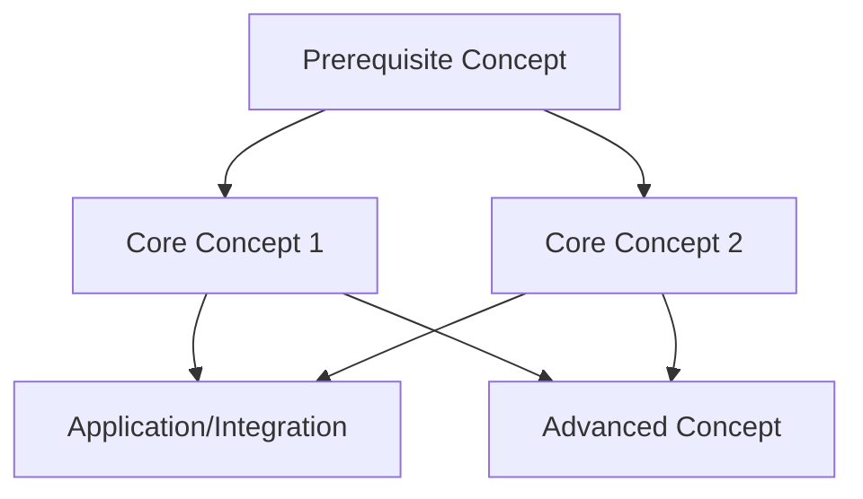

## When to use

- A topic has many related sub-topics
- User wants to understand "where this fits" in the bigger picture
- Planning a learning path through a complex domain
- Visualizing dependencies between concepts

## Technique: Concept Mapping

### Step 1: Identify Nodes
List all concepts involved (5-15 is ideal). Include:
- Core concepts (must understand)
- Related concepts (provide context)
- Prerequisite concepts (needed first)

### Step 2: Define Relationships
For each pair of concepts, determine:
- **Depends on**: A requires B to work
- **Enables**: A makes B possible
- **Complements**: A and B work together
- **Contrasts with**: A is an alternative to B

### Step 3: Build the Map
Create a Mermaid diagram or structured list showing:
- Prerequisites at the bottom or left
- Core concepts in the middle
- Applications at the top or right
- Arrows indicating flow of understanding

## Mermaid Diagram Template



## Learning Path Template

```markdown
## Knowledge Map: [Topic Name]

### Prerequisites
1. [Concept] - Why needed: ...
2. [Concept] - Why needed: ...

### Core Concepts
1. [Concept] - Key insight: ...
2. [Concept] - Key insight: ...

### Integration Points
- [Concept A] + [Concept B] → [Result]

### Advanced Topics
1. [Advanced Concept] - Builds on: ...

### Mermaid Diagram
```mermaid
[diagram here]
```
```

## Tips

- Keep maps focused: one primary topic per map
- Use color or grouping to distinguish types of concepts
- Include "you are here" marker when possible
- Validate dependencies: can someone learn this in the order presented?
